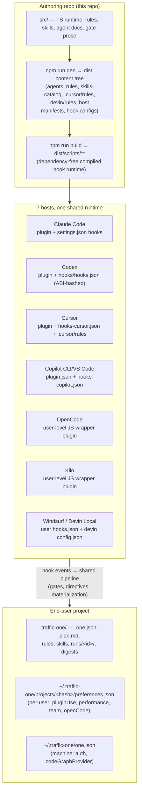
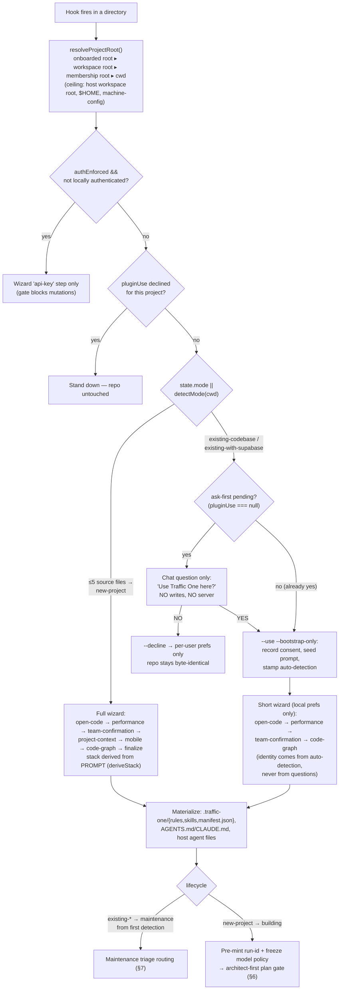
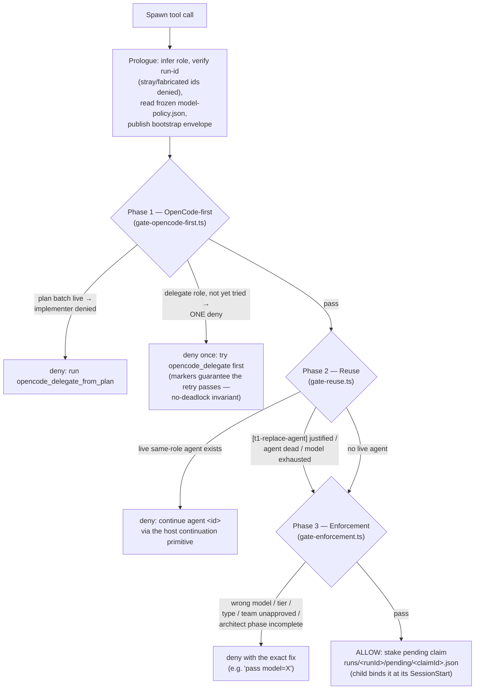
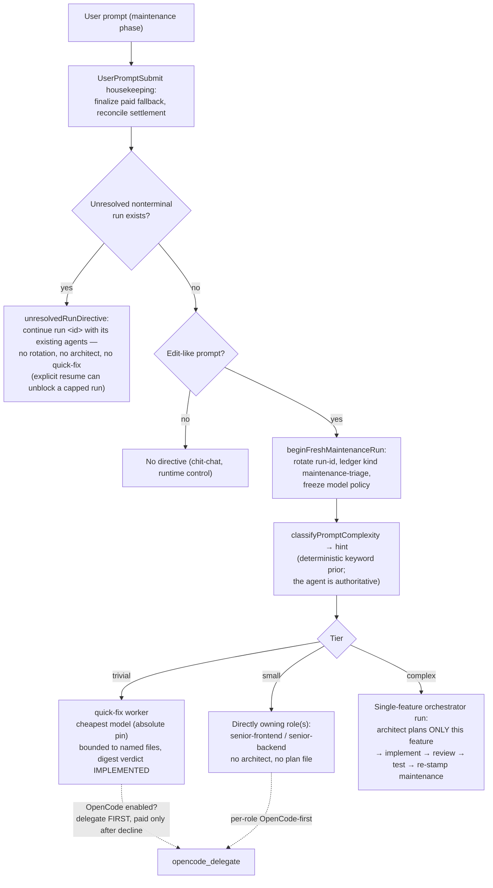

# Traffic One — Runtime Architecture

This document explains how the shipped plugin behaves at runtime: the full flow
from first hook fire to a settled run, every supported agent host and how we
attach to it, what spawns the senior role agents on each host, how stacks are
detected and routed, what happens on an existing codebase with or without
`.traffic-one` config, and how agent reuse works. It complements `ref.md`
(the source map) and `README.md` (install instructions). Source of truth for
every claim is `src/`; file references are to this repo.

Three vocabularies appear throughout — they are different layers, do not
conflate them:

| Vocabulary | Values | Where |
| --- | --- | --- |
| **mode** | `new-project`, `existing-codebase`, `existing-with-supabase` | `detectMode()`, `src/shared/detection/artifacts.ts:56` |
| **stack id** | `minimal`, `default`, `custom-frontend`, `custom-backend`, `custom-stack` | `STACK_IDS`, `src/config/stacks.ts` |
| **structural profile id** | 17 ids (`vite-react` … `backend-only`), see §5 | `STRUCTURAL_PROFILE_IDS`, `src/shared/capabilities/types.ts:7` |

"Maintenance" is **not a mode** — it is a lifecycle phase
(`lifecycle.phase: 'building' | 'maintenance'`, `src/shared/state/lifecycle.ts`).
Any `existing-*` mode is maintenance from first detection; `new-project` starts
in `building` and flips after the first successful run.

---

## 1. The big picture



Every host funnels its hook events into the **same** compiled pipeline
(`dist/scripts/**`); only the entry shim, wire format, and event vocabulary
differ per host. All hook configs are rendered from a single source
(`src/gen/sources/hooks.ts`). Project behavior is driven by three state
stores: the shared, committed `.traffic-one/.one.json`; the per-user
per-project `preferences.json` (machine-local choices — plugin consent,
performance level, team mode, OpenCode delegation); and the machine-global
`~/.traffic-one/one.json` (auth, code-graph provider).

---

## 2. Hosts

The canonical host union is `TrafficOneHost`
(`src/shared/host/capability-schema.ts:9`): **`claude`, `codex`, `cursor`,
`opencode`, `kilo`, `copilot`, `windsurf`** — exactly seven. **Devin is not an
eighth host**: "Devin Local" is the current Windsurf backend; it has its own
entry (`src/hooks/devin-entry.ts`) and adapter, but both report
`host: 'windsurf'` and are disambiguated via `TRAFFIC_ONE_WINDSURF_BACKEND`
(`cascade` | `devin`).

Host detection (`detectHost()`, `src/shared/host/index.ts`): explicit
`--host=<id>` argv is authoritative → `TRAFFIC_ONE_HOST` env →
`CURSOR_PLUGIN_ROOT` → `CODEX_*` markers → default `claude`.

### 2.1 Attachment per host

| Host | Attachment | Hook config | Entry shim (dist) | Host stamp |
| --- | --- | --- | --- | --- |
| **claude** | Native Claude Code plugin (`.claude-plugin/plugin.json`) | `settings.json` | `scripts/hook-runtime.cjs` → `claude-entry` | default detection |
| **codex** | Codex plugin (`.codex-plugin/plugin.json`); hook commands trust-hashed (ABI v2 — byte changes invalidate every `trusted_hash`) | `hooks/hooks.json` | same `hook-runtime.cjs` → `claude-entry` (adapter id `codex`) | `CODEX_*` env |
| **cursor** | Cursor plugin (`.cursor-plugin/plugin.json`) + generated `.cursor/rules/*.mdc` mirror | `hooks/hooks-cursor.json` | `scripts/cursor-hook-runtime.cjs` | `CURSOR_PLUGIN_ROOT` |
| **copilot** | Copilot plugin (root `plugin.json`, CLI + VS Code) | `hooks/hooks-copilot.json` | `scripts/copilot-hook-runtime.cjs` | env `TRAFFIC_ONE_HOST=copilot` |
| **opencode** | Consent-gated user-level wrapper installed by `scripts/opencode-host.cjs` → `~/.config/opencode/plugins/traffic-one.js` (registered in the opencode config `plugin` array) | wrapper registers `tool.execute.before/after`, `chat.message`, system transform, `event` bus | wrapper `spawnSync` → `scripts/opencode-hook-runtime.cjs` | `--host=opencode` |
| **kilo** | Same pattern via `scripts/kilo-host.cjs` → `~/.config/kilo/plugin/traffic-one.js` (auto-loaded from that dir) | wrapper hooks + `shell.env`, advisory `permission.ask` | wrapper `spawnSync` resolved node → `scripts/kilo-hook-runtime.cjs` | `--host=kilo` |
| **windsurf** | One installer (`scripts/windsurf-host.cjs`) writes three surfaces: legacy Cascade hooks (`~/.codeium/windsurf/hooks.json`, exit-code-2 deny protocol), Devin Local native hooks (`~/.config/devin/config.json`, Claude-style), and a global-rules block (`memories/global_rules.md`) | per backend | `scripts/windsurf-hook-runtime.cjs` / `scripts/devin-hook-runtime.cjs` | `--host=windsurf` |

Per-project opt-in/out markers for the wrapper hosts: `.opencode/traffic-one.json`,
`.kilo/traffic-one.json` (no marker needed for normal auto-run).

### 2.2 Capability contract per host

`HOST_CAPABILITIES` (`src/shared/host/capability-schema.ts`) declares what each
host can enforce. Runtime observation can downgrade `prevention` from
`pre-tool` to `completion-only` unless the primary blocking point has been
observed *denying* (evidence sidecar `runs/<runId>/host-capability-v1.json`).

| Host | Primary blocking point | Typed subagents | Model observation |
| --- | --- | --- | --- |
| claude | `PreToolUse` | yes | spawn-request-only |
| codex | `PreToolUse` (+ first-tool child model check) | no | **first-tool-authoritative** |
| cursor | `preToolUse` (+ beforeShellExecution, beforeReadFile, beforeMCPExecution) | yes | spawn-request-only |
| opencode | `tool.execute.before` (deny = wrapper throws) | yes | spawn-request-only |
| kilo | `tool.execute.before` | no | spawn-request-only |
| copilot | `PreToolUse` | no | spawn-request-only |
| windsurf | `pre_write_code` (+ pre_run_command, pre_mcp_tool_use) | no | spawn-request-only |

All entries share a fail-closed boundary (`src/hooks/fail-closed.ts`):
malformed/truncated stdin at a pre-tool point **denies** rather than
normalizing to allow, and the managed public-MCP tool pair is hard-denied
before any module loads.

### 2.3 Content mirrored per host

- Every host: project-materialized `.traffic-one/rules/**`, `.traffic-one/skills/**`,
  `manifest.json`, root `AGENTS.md` (+ `CLAUDE.md` symlink when absent).
- **cursor**: `.cursor/agents/<role>.md` (filename **is** the `subagent_type`) + shipped `.cursor/rules/*.mdc`.
- **codex**: `.traffic-one/agents/<role>.md` full role contracts (Codex children only receive the compact kernel natively).
- **copilot**: `.github/agents/<role>.md` + shipped `agents/*.agent.md` twins.
- **opencode**: **user-local** model-pinned subagents `~/.config/opencode/agents/traffic-one-<projectHash12>-<role>.md` (hash prefix prevents cross-project overwrite).
- **kilo**: `.kilo/agents/<role>.md` contracts (model deliberately not pinned).
- **windsurf**: `.devin/agents/<role>/AGENT.md` native custom subagents + `.devin/rules/*.md` mirror.

---

## 3. Onboarding and the three project cases

The onboarding gate (`src/modules/onboarding-gate/handler.ts`, PreToolUse
priority 10) blocks mutating tools until `computeOnboarding(root).done`
(`src/shared/onboarding-server/flow.ts`) — the **same predicate the wizard
uses**, so gate and wizard cannot disagree. Read-only orientation, state-file
writes, and the approved bootstrap/wait commands stay allowed. Subagents are
never routed to onboarding.



### Case A — new / empty project (≤ 5 source files)

SessionStart deliberately leaves a pristine dir untouched; activation happens
on the first *coding-intent* prompt, which is seeded as `originalPrompt`. The
full wizard runs (steps above); the **stack comes from the prompt**, not from
detection (`deriveStack`/`classifyPromptForStack` — no-signal prompts floor to
`stack: 'default'` = React/Vite + Supabase). Completeness is the large
new-project contract (`isNewProjectOnboardingIncomplete`,
`src/shared/onboarding/predicates.ts`). Lifecycle stays `building`; feature
writes are denied until the architect's `plan.md` exists (§6).

### Case B — existing codebase, **no** `.traffic-one`

1. SessionStart detects `existing-codebase` / `existing-with-supabase`, and —
   with ask-first on (`ASK_USE_PLUGIN_FIRST`) — emits **only** the consent
   question. Zero writes: a "no" is recorded in per-user prefs
   (`~/.traffic-one/projects/<hash>/preferences.json`,
   `src/shared/state/plugin-use.ts`) and the repo stays byte-identical.
2. On "yes", `onboarding-wait.cjs --use --bootstrap-only` records consent,
   seeds the prompt, and `stampExistingCodebaseDetection` writes the full
   detected identity in one shot (`src/shared/onboarding/detection-stamp.ts`):
   `mode`, `stack`, `frontend`, `backend`, `mobile?`, `realtime`,
   `confirmed: true`, `onboardingComplete: true`, `autoDetected: true`,
   `evidence[]`, and `lifecycle: maintenance('existing-detected')`.
   Guards skip workspace sub-packages and dirs owned by an enclosing project.
3. The **short wizard** (local HTTP server + traffic.io dashboard page)
   collects only per-user preferences: OpenCode delegation, performance level,
   team confirmation, code-graph provider. There are no project-identity
   questions — identity is detection. A sparse repo where detection finds
   nothing gets **no wizard** at all (SessionStart may floor it to
   `stack: 'minimal'`).
4. The waiter completes: re-stamp (idempotent), materialize **before** the
   agent resumes, then `postSetupTriage` routes the original request through
   maintenance triage — because existing codebases are already in the
   maintenance phase.

The wizard mechanics (shared with case A): loopback-only Node HTTP server on
an ephemeral port with a 32-byte token; the dashboard URL
`https://traffic.io/onboarding/agent#p=<port>&t=<token>` carries port+token in
the **fragment** so the token never reaches traffic.io; a blind health probe
appends the `http://127.0.0.1:<port>/local` fallback wizard only when the
hosted page looks unhealthy. The agent must **post the link and wait** — the
gate denies browser-open commands and backgrounded waiters, and a Stop-hook
backstop re-delivers the link if the turn ends with setup pending.

### Case C — existing codebase **with** `.traffic-one` present

A `.one.json` carrying a non-empty `mode` makes the dir an **onboarded root**
that anchors upward root resolution (`src/shared/hook/paths.ts`). Every
session then:

- normalizes state (`normalizeState` — legacy stack aliases, canonical shape),
  scrubs machine-local pref fields leaked into the committed `.one.json` into
  per-user `preferences.json`, and reconciles run state
  (`reconcileRunSettlement`, claim pruning, retention sweeps that heal leaked
  nested `.traffic-one` roots).
- re-checks materialization freshness: `isMaterialized` is false when the
  `materializedStack` fingerprint or `materializedVersion` differs — so **every
  plugin version bump re-materializes** rules/skills/manifest/AGENTS on the
  next hook.
- reconciles stack drift from artifacts (`reconcileStackFromArtifacts` — e.g.
  Go artifacts appearing post-scaffold), but **never during a frozen run**
  (drift is recorded for the next run).

Re-onboarding (the wizard reappearing) happens only when `computeOnboarding`
flips false again: lost auth (api-key-only re-auth), **this user's** local
prefs missing (second developer / new machine — shared repo state untouched),
performance-target drift (host plan or model-catalog change re-opens the
performance step), or a team/performance mismatch.

---

## 4. Stack cases

### 4.1 Mode and stack detection (existing codebases)

`detectMode(cwd)`: ≤ 5 source files → `new-project`; else Supabase deps →
`existing-with-supabase`; else `existing-codebase`.

`detectStackFromCodebase(cwd)` (`src/shared/detection/artifacts.ts:164`) maps
markers → state-level stack:

| Marker | Result |
| --- | --- |
| `go.mod`/`go.work` (cwd, `services/api`, `apps/api`, `backend`) | `custom-backend`, backend `go` |
| `pubspec.yaml` | `custom-frontend`, mobile `flutter` |
| `Package.swift` / `.xcodeproj` / `.xcworkspace` | `custom-frontend`, mobile `swift-native` |
| gradle files | `custom-frontend`, mobile `kotlin-android` |
| composer `laravel/framework` | `custom-backend`, backend `laravel` |
| package.json: `next`/`nuxt`/`vue`/`svelte`/`@angular/core`/`astro`/solid/remix/gatsby/qwik/preact/lit/ember/alpine/stencil/marko | that frontend, `custom-frontend` |
| `expo`/`react-native` | mobile `react-native-expo` |
| bare `react` | `react-vite`; + Supabase deps → stack `default`, else `custom-backend` |
| `@supabase/*` / `firebase` | backend `supabase` / `firebase` |
| `socket.io`/`ws` | `realtime: 'light'` |

Final classification: UI + backend → `custom-stack`; UI only →
`custom-frontend`; backend only → `custom-backend`; react-vite+supabase
web-only → `default`. A second, per-write **runtime capability detection**
layer (`src/shared/capabilities/`) independently probes frontend framework,
backend language, native framework, and surfaces — it is what architecture
compilation actually uses.

### 4.2 New-project structural profiles (17)

`capabilityProfileForProject` selects exactly one structural profile
(`src/shared/capabilities/profile.ts`); each maps 1:1 to a mode rule
`rules/modes/new-project-<id>.md`:

`vite-react`, `next-app`, `next-pages`, `nuxt`, `vue`, `sveltekit`, `svelte`,
`astro`, `angular`, `server-rendered` (Laravel Blade/Inertia), `generic-web`,
`react-native`, `swift-native`, `kotlin-native`, `flutter-native`,
`backend-only`, and the **blocking** `unsupported-hybrid` (web *and* native
detected with no `architectureTarget` chosen — `compileArchitecture` throws;
it is a fail-closed state, not an architecture).

Defaults and gates: an ambiguous app prompt defaults to React/Vite + Supabase
(`stack: 'default'`); an explicit API-only prompt yields `frontend: none` →
`backend-only`. On Windsurf/Devin a scaffold gate additionally blocks
`create-next-app`-style scaffolders off-stack or before `plan.md` exists
(architect-first; shell scaffolders would slip the plan gates).

### 4.3 Capability registry → eligible roles

Surfaces: `web-ui`, `native-ui`, `api`, `cli`, `worker`, `data`
(`src/shared/capabilities/types.ts`). Role eligibility
(`profile.ts:147`): `senior-architect`, `senior-reviewer`, `senior-tester`,
`senior-shipper` are universal; `senior-frontend` requires `web-ui` or
`native-ui`; `senior-backend` requires a real backend or any of
`api|cli|worker|data`. The profile also fixes source roots, entrypoints, layer
roots, QA adapters (`playwright`, `maestro`, `xcode-simulator`,
`android-emulator`, `flutter-driver`) and skill buckets.

The profile is **frozen per run**: `ensureArchitectureRunSnapshot` writes
`runs/<runId>/capability-v1.json` + `baseline-v1.json` once at run mint —
adding framework markers mid-run cannot steer roots or roles.

### 4.4 Per-stack rules and skills at runtime

`composeRuleManifest` (`src/shared/stacks/index.ts`) selects the rule union:
13 common mandatory rules + frontend family (React/Vite mandatory set, RN,
Ionic overlay) + `BACKEND_RULES` per language + postgres on evidence. Skills
are selected by capability bucket (`SKILL_FILTERS`,
`src/config/skill-filters.ts`) and pruned per role at SessionStart. The
implementer agent docs then dispatch stack-specific skills internally
(e.g. backend: `springboot-*` on JVM, `postgres-review` before migrations;
frontend: `nextjs-turbopack` only when `frontend === 'nextjs'`).
Materialization re-runs on any relevant write via the PostToolUse
`post-stack-setup` hook, so a stack change re-lands the right rules.

---

## 5. Agent spawning

### 5.1 What spawns a role agent, per host

`hostSpawnType(host, role, cwd)` (`src/shared/host/spawn-types.ts`) is the
single answer. Roles: `senior-architect`, `senior-frontend`,
`senior-backend`, `senior-reviewer`, `senior-tester`, `senior-shipper`, plus
the maintenance `quick-fix` worker.

| Host | Spawn tool | Parameter | Primary type | Fallback | Continuation primitive |
| --- | --- | --- | --- | --- | --- |
| **claude** | `Task`/`Agent` (plugin agent types `traffic-one:senior-<role>`) | `subagent_type` | role name | `general-purpose` | `SendMessage {to: agentId}` (requires `CLAUDE_CODE_EXPERIMENTAL_AGENT_TEAMS=1`) |
| **cursor** | `Task` | `subagent_type` | role name (from materialized `.cursor/agents/<role>.md`) | `generalPurpose` | re-invoke `Task` with `resume: <uuid>` |
| **codex** | `spawn_agent` (`fork_turns: "none"`) | `task_name` | underscored role, e.g. `senior_architect` | — | `followup_task` / `send_message` |
| **copilot** | background `task` | `name` | role name | — | `task` with recorded `agent_id` |
| **opencode** | `task` | `subagent_type` | `traffic-one-<projectHash12>-<role>` (the materialized user-local agent; built-in `general` is denied — it inherits the parent model) | — | no true resume; `[t1-replace-agent]` replaces |
| **kilo** | built-in `general` task | `subagent_type` | `general` + first-line `[t1-role: senior-<role>]` marker + "read `.kilo/agents/<role>.md`" | — | per recorded entry |
| **windsurf** (Devin Local) | `run_subagent` (+ `read_subagent`) | `profile` | `subagent_general` + `.devin/agents/<role>/AGENT.md` contract | — | per recorded entry |

When a host rejects the primary type (stale registry after mid-session
materialization), the retry uses the fallback **plus** the `[t1-role:]` prompt
marker, which the role resolver accepts as first-class evidence. In Low
performance (`team.mode: "main-agent"`) all subagent primitives are disabled
and the phases run inline in the parent thread.

### 5.2 The spawn gate — every spawn on every host

All spawns funnel through one PreToolUse hook, `agentModelGate`
(`src/modules/agent-model/handler.ts`, matching
`Task | Agent | spawn_agent | run_subagent | spawn_subagent`), which runs
three phases over a shared `GateContext`:



Model selection: performance level → per-role tier (`highest` / `balanced` /
`cheapest`; tester always cheapest) → concrete model per host from the One MCP
model catalog, frozen per run in the immutable
`runs/<runId>/model-policy.json`. The `model` **param** is authoritative on
claude/cursor/codex; Codex children are verified at their first tool call
(the only host with first-tool-authoritative model observation). The
`quick-fix` cheapest-model pin is absolute in every mode — `team.overrides`
cannot lift it.

### 5.3 The OpenCode delegation path (free-first)

When the user approved OpenCode delegation, work is offered to a free
OpenCode worker before any paid spawn:

- **MCP tools** (bundled server, `src/runners/opencode-mcp/`):
  `opencode_delegate {role, task, runId, allowedFiles}`,
  `opencode_delegate_from_plan {runId}`, `opencode_status {runId, waitMs}`.
- The architect's plan carries a bounded 3–6-unit delegation queue between
  `<!-- opencode-delegate:start/end -->` markers; Step 0 of the implement
  phase runs the whole batch (isolated throwaway git worktree per unit, diff
  validated against the per-role file allowlist, digest ledger
  `digests/<runId>/opencode-<role>.md`).
- **Try-once-then-paid-fallback is an invariant**, not a policy hope: the
  single deny writes `opencode-gate-denies/<role>`, the runner writes
  `opencode-attempts/<role>`, and any of the markers lets the next paid spawn
  through. OpenCode is best-effort on every host — never a hard block.
  Circuit breakers cover gateway outages and stalls; opencode/kilo hosts never
  self-delegate.

---

## 6. The build run lifecycle (new project)

```mermaid
sequenceDiagram
    autonumber
    participant U as User
    participant P as Parent (orchestrator)
    participant H as Hook gates
    participant A as senior-architect
    participant OC as OpenCode batch
    participant I as Implementers (frontend/backend)
    participant V as Reviewer ∥ Tester
    participant S as senior-shipper

    Note over H: onboarding complete → run-id pre-minted,<br/>model-policy.json frozen (hook-owned, never fabricated)
    U->>P: build request
    P->>A: spawn (tier model, cold context)
    A->>A: plan.md + project memory +<br/>architecture-input-v1.json (semantic only)
    A->>H: write digest ending PLAN_READY
    H->>H: compile: architecture-v1.json,<br/>verification-v2.json, assignments.json,<br/>per-role WorkUnit + bootstrap envelopes
    Note over H: digest write DENIED until memory baseline,<br/>valid input, satisfiable contract,<br/>and the OpenCode queue (3–6 units) exist
    P->>OC: Step 0 — opencode_delegate_from_plan
    Note over H: implementer spawns denied while the batch is live
    P->>I: spawn eligible roles (parallel, allowlisted)
    I->>H: digests end IMPLEMENTED (or BLOCKED)
    P->>V: spawn reviewer ∥ tester (tester = cheapest)
    V->>P: APPROVED / CHANGES_REQUESTED · TESTS_GREEN / TESTS_FAILING
    loop fix cycles (cap 2 per verifier)
        P->>I: ONE continuation message (findings verbatim)
        I->>P: FIXES_APPLIED / FIXES_FAILING
    end
    opt explicit deploy intent only
        P->>S: spawn shipper (pre-flight: APPROVED + TESTS_GREEN +<br/>security check; stamps lastShipperApprovalAt)
        S->>H: deploy command (deploy gate: 10-min window +<br/>passing security fingerprint)
    end
    P->>H: run-status.cjs --status completed --outcome verified|shipped
    Note over H: evidence-gated in the runner:<br/>APPROVED + TESTS_GREEN digests +<br/>hash-matching QaReportV2
    P->>P: markMaintenance('orchestrator') → lifecycle: maintenance
```

Key facts:

- **Run-id** is an epoch-ms digit string pre-minted by the onboarding-gate
  hook; the orchestrator only reads it. Spawn prompts with a stray run-id and
  writes under a wrong `runs/<id>/` path are denied.
- **Enforcement is hooks, not prose.** The role tokens (`PLAN_READY`,
  `IMPLEMENTED`, `APPROVED`, `CHANGES_REQUESTED`, `TESTS_GREEN`,
  `TESTS_FAILING`, `SHIPPED`, and the reply tokens `FIXES_APPLIED` /
  `FIXES_FAILING`) are checked at the digest/write boundary by `plan-guard`
  gates; deny prose lives in `SKILL.md` `T1BLOCK` markers with **verbatim TS
  fallbacks**, so a damaged SKILL.md never disables enforcement.
- **Feature-source protection**: in subagents mode only the spawned role
  session owning a path in `assignments.json` may write it; the parent is
  denied; the tester may only touch test files and test infra; the reviewer is
  read-only.
- **Settlement** (`runs/<runId>/settlement-v2.json`): `planned → active →
  code-delivered → validating → verified` (or `failed` / `blocked`).
  `verified`/`failed` are immutable; the only `blocked → active` edge requires
  the literal reason `user-authorized-extra-cycle`. `TESTS_GREEN` is only
  valid with a parser-valid `QaReportV2` whose hashes match the verification
  contract — hand-authored reports fail.
- The main hook-gate inventory (PreToolUse priority order): one-mcp tool
  denial (−100), Codex child model observation (−90), onboarding gate (10),
  model-choice gate (15, Cursor), **plan-write gate** (20 — plan gate,
  run-team, sidecar ownership, static checks, completion gates), scaffold gate
  (22, Windsurf), Supabase local-stack gate (24), **deploy gate** (25 —
  `lastShipperApprovalAt` + security-check fingerprint, both within 10 min),
  library allowlist (30), **spawn gate** (40), graphify hint (50,
  context-only).

---

## 7. The maintenance phase

### 7.1 Entering maintenance

`lifecycle.phase` flips to `maintenance` via `markMaintenance(cwd, source)`
(`src/shared/state/lifecycle.ts`), which also releases all run claims and
creates the initial git commit (OpenCode sandboxing needs a HEAD). Three ways
in:

1. **`existing-detected`** — existing codebases are maintenance from first
   detection (no flip needed; inferred from mode).
2. **`orchestrator`** — Phase 5 after a strictly terminal run (primary path).
3. **`heuristic` / `prompt-boundary`** — the guarded safety net
   `maybeFlipToMaintenance` (`src/modules/materialize/build-complete.ts`) when
   the explicit stamp never landed: new-project mode, run settled, no active
   claims, > 15 source files on disk.

`mode` deliberately stays `new-project` after the first build — the lifecycle
is what says the greenfield build is over.

### 7.2 Triage: every maintenance prompt



The classifier (`src/shared/triage/classify.ts`) returns
`trivial | small | complex` with `low | high` confidence. Design bias, by
construction: **highest-complexity signal wins**, and an ambiguous prompt
resolves to `small`, **never** `trivial` (a false "complex" wastes tokens; a
false "trivial" ships an under-engineered feature). Strong complex signals:
auth, payments, data-model/schema/migrations, integrations/webhooks,
realtime, large surfaces (dashboards/wizards/end-to-end). Trivial signals:
typo, styling, rename, formatting, copy changes. "just/quick/small" drops a
tier only when a concrete trivial signal corroborates it.

The routing rubric (the `task-triage` skill) in one line each:

- **trivial** → `quick-fix` worker: self-contained low-risk edit, no design
  decisions. Hard scope contract: only the files named in the spawn prompt, no
  new dependencies, no schema/API changes — "if the task needs any of those it
  was mis-triaged: stop and say so". Verification is never skipped — only the
  planning ceremony is.
- **small** → the directly owning role(s), scoped by the newest existing
  assignments manifest; escalate if the files reveal cross-cutting impact.
- **complex** → a fresh single-feature orchestrator run; the architect
  re-runs but plans **only the requested feature** — never re-plans or
  re-scaffolds the app.

Gate differences vs the build phase: the architect-first build directive is
suppressed; the Step-0 plan-batch gate only re-arms on a **fresh** architect
queue for this run (a hand-copied `assignments.json` never looks fresh); the
per-role OpenCode-first deny extends into maintenance even with no plan queue;
maintenance writes without a fresh assignment fail closed against the bounded
WorkUnit allowlist instead of a stale build manifest; and react-structure
violations in pre-existing code downgrade to advisories — a maintenance run
must never deadlock on a repo the plugin didn't write.

### 7.3 OpenCode maintenance fallback (proof-carrying)

When an OpenCode delegation fails **after** a bounded contract was published,
the runner records `fallback-pending` plus a hash-sealed pre-image snapshot of
the allowlisted files. The paid worker then does the work, and the next hook
boundary finalizes it (`finalizePaidMaintenanceFallback`,
`src/shared/maintenance/fallback.ts`) only when *all* proof holds: envelope /
work-unit / allowlist hashes match, the current tree shows an in-allowlist
delta versus **both** the pre-image and the immutable run baseline ("revert
and re-save" proves nothing), and the role digest carries an unambiguous
`verdict: IMPLEMENTED` no older than the OpenCode failure. Only then does the
marker become `fallback-paid` (the sole way that outcome counts as terminal —
`src/shared/maintenance/terminal.ts`) with settlement `code-delivered`;
verification is still owed afterwards. `fallback-pending` is deliberately
nonterminal: permission to continue is not evidence that the continuation ran.

---

## 8. Agent reuse

Reuse is **strictly enforced, not aspirational**: one live agent per role per
run.

- **Registry**: `.traffic-one/runs/<runId>/agents.json`
  (`RunAgentEntry {agentId, resumeId, role, model, parentSessionId, replaced, …}`),
  filled by the PostToolUse spawn recorder, SubagentStart binds
  (Codex/Copilot/Cursor), the first-prompt `[t1-role:]` bind (OpenCode/Kilo),
  and claim binding itself.
- **The dedup deny**: a fresh same-role spawn while a live entry exists is
  denied by `gate-reuse.ts` with the recorded agent id and the exact host
  continuation recipe (SendMessage / followup_task / Task resume / recorded
  agent_id). A spawn already carrying an id/resume token is a resume and
  passes. The orchestrator protocol mandates continuation for every fix
  cycle, re-review, and re-test (a measured pathological run burned 7 frontend
  spawns ≈ 46M tokens where one continued agent should have served).
- **The escape hatch**: `[t1-replace-agent]` in the spawn prompt retires the
  recorded agent — accepted only when justified (context/API exhaustion
  vocabulary), the agent is unbindable, or its model is durably exhausted
  (per-role exhaustion ledger + tier-fallback rotation). Cursor gets
  dead-agent grace timers (90 s corroborated / 270 s hard).
- **Claims**: the spawn gate stakes `runs/<runId>/pending/<claimId>.json`; the
  child's SessionStart binds it to its real session id — that bound claim is
  what authorizes role-scoped feature-source writes. (Codex binds at
  SubagentStart instead, since its parent PreToolUse may not fire.)
- **Boundaries of reuse**: per-run and per-parent-session. Entries from
  another parent session never match — an in-process agent dies with its
  session, so a resumed orchestrator spawns fresh without friction.
  Cross-session resume is intentionally unsupported. Role agents are kept
  alive through verification and into the maintenance handoff; each
  maintenance prompt that rotates the run gets fresh agents, while an
  unresolved run keeps its existing ones.
- **OpenCode "reuse" is file-level**: the user-local
  `traffic-one-<hash12>-<role>.md` agents are regenerated only when the
  lineup/model changes (`writeTextIfChanged`), pruned when a role leaves the
  lineup, and never overwrite user-edited files. On Claude, agent-teams
  continuation requires `CLAUDE_CODE_EXPERIMENTAL_AGENT_TEAMS=1`; the
  historical claim-binding deadlock under agent teams is fixed
  (`hookSessionIdentity` now recognizes teams workers and the bind mirrors
  into the registry so the dedup gate sees them).

---

## 9. State on disk (reference)

```text
<project>/.traffic-one/
├── .one.json                # shared canonical state (committed): mode, stack,
│                            # frontend/backend, currentRunId, spawnIndex,
│                            # lifecycle, openCode(+Delegation), materialized*,
│                            # lastShipperApprovalAt, lastSecurityCheck*
├── plan.md                  # architect deliverable (≤250 lines; opencode queue
│                            # + verification-intent blocks)
├── product.md stack.md coding.md security.md known-issues.md api.md
│   database.md deployment.md decisions/NNNN-*.md   # project memory + ADRs
├── rules/**  skills/**  manifest.json              # materialized context
├── agents/<role>.md         # Codex role contracts
├── runs/<runId>/
│   ├── capability-v1.json baseline-v1.json          # frozen profile+baseline
│   ├── architecture-input-v1.json                   # architect (semantic)
│   ├── architecture-v1.json verification-v2.json    # runtime-compiled
│   ├── assignments.json model-policy.json           # runtime-owned, immutable
│   ├── bootstrap/<role>/active.json                 # WorkUnit + envelope
│   ├── pending/<claimId>.json → <agentSessionId>.json  # spawn claims
│   ├── agents.json                                  # reuse registry
│   ├── settlement-v2.json run.json maintenance.json
│   └── opencode-{attempts,gate-denies,plan-batch}/  # free-first markers
├── digests/<runId>/<role>.md   # ~2KB handoffs; verdict tokens live here
├── fix-cycles/<runId>/<role>-fix-<n>.md
└── reports/qa/<runId>/report-v2.json + evidence sidecars

~/.traffic-one/
├── one.json                                # machine: auth, codeGraphProvider
├── one-mcp.json                            # model-catalog cache
├── projects/<sha256(root)>/preferences.json  # per-user: pluginUse, openCode,
│                                             # hosts.<host>.performance/team
└── projects/<hash>/onboarding/<host>/server.json  # wizard registry
```

---

## 10. Where to read the code

| Concern | Entry points |
| --- | --- |
| Host entries & adapters | `src/hooks/*-entry.ts`, `src/adapters/*`, `src/shared/host/` |
| Hook config generation | `src/gen/sources/hooks.ts`, `src/gen/emit/hooks.ts` |
| Onboarding gate & wizard | `src/modules/onboarding-gate/`, `src/shared/onboarding-server/`, `src/runners/onboarding-{server,wait,toolchain}/` |
| Mode/stack detection | `src/shared/detection/`, `src/shared/onboarding/detection-stamp.ts` |
| Capability profiles & compiler | `src/shared/capabilities/`, `src/shared/architecture-contract/` |
| Plan/write/deploy gates | `src/modules/plan-guard/` |
| Spawn gate (3 phases) | `src/modules/agent-model/` |
| Spawn types & continuation | `src/shared/host/spawn-types.ts`, orchestrator `SKILL.md` |
| OpenCode delegation | `src/runners/opencode{,-mcp}/`, `src/shared/opencode-{roles,plan,queue}/` |
| Claims & reuse registry | `src/shared/state/run-agent/` |
| Lifecycle & maintenance | `src/shared/state/lifecycle.ts`, `src/shared/triage/`, `src/modules/session/triage-directive.ts`, `src/shared/maintenance/`, `src/modules/quick-fix/` |
| Settlement & evidence | `src/shared/run-settlement/`, `src/shared/strict-verification-evidence.ts`, `src/shared/qa-report-v2/` |
| Materialization | `src/shared/materialize/`, `src/modules/materialize/` |
